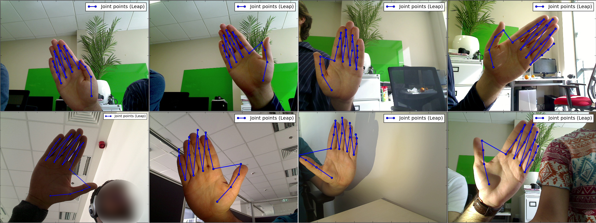
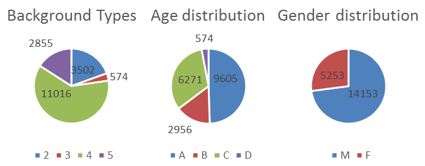
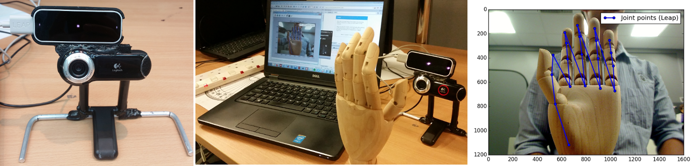
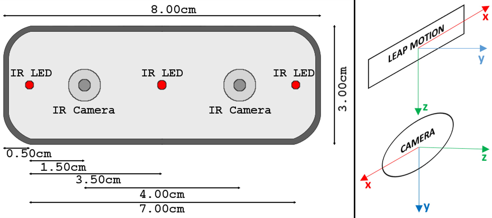

# NUIG_Palm2 Database of palmprints

NUIG_Palm2 represents a collection of hand images acquired in a variety of conditions, with the ultimate goal of training Machine Learning algorithms that can perform the task of Palmprint Region of Interest (ROI) extraction.
The palmprint ROIs can then be used for Palmprint recognition.

## How to obtain the database
* coming soon

## Acquisition Protocol
An acquisition protocol was developed, where every participant was asked to hold their hand in front of the acquisition setup at a distance of around 30cm. The main variations considered were the presence of strong shadows, glare on the hand's surface, as well as varied hand pose. 
A smartphone's flashlight was used to direct strong light from multiple angles to the surface of the participant's hand, thus enabling all regions of the hand to be either affected by glare or by shadows of varying intensity.  
The poses that were considered correspond to those scenarios associated to palmprints in 'the wild': straight fingers but either the thumb or a side finger (index or pinky) touching one of the central fingers. Furthermore, as many orientations as possible were considered, but this number depended on the limits of LM device or the participant's range of motion.  
Furthermore, several backgrounds were used, but this was not the main focus of the collection. However, most of the acquisitions included 2 types of backgrounds: 'cluttered office' and 'skin-color background'.

The acquisition session was estimated to last around 15-20 minutes, with intervals of around 20-30 seconds where one of the above mentioned factors was varied. The span of each interval was used to acquire image frames from the webcam, together with the 3D coordinates (according to the webcam's coordinate system) as well as the 2D coordinates. This process was monitored by the investigator by looking at the real-time projection of 3D coordinates onto the webcam's image plane.  
The resolution at which the images were saved was the maximum possible output possible for the webcam model that was used - 1200x1600 pixels. 

Age groups:
* 20:30 (A)
* 30:40 (B)
* 40:50 (C)
* 50+ (D)

## Some database statistics
* Participants: 26
* Number of hands: 52
* Number of hand images: 24,631

## About the Leap Motion (LM) device
* [Wikipedia page](https://en.wikipedia.org/wiki/Leap_Motion)
* Repo used for reading the 3D points from the LM: [here](https://github.com/AdrianUng/Leap-Motion-project-points-onto-image)

source of Leap Motion structure: [[1]](https://www.mdpi.com/1424-8220/13/5/6380) 

## References:
[1] Weichert, Frank, et al. "Analysis of the accuracy and robustness of the leap motion controller." Sensors 13.5 (2013): 6380-6393
